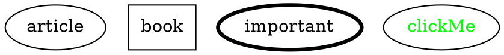
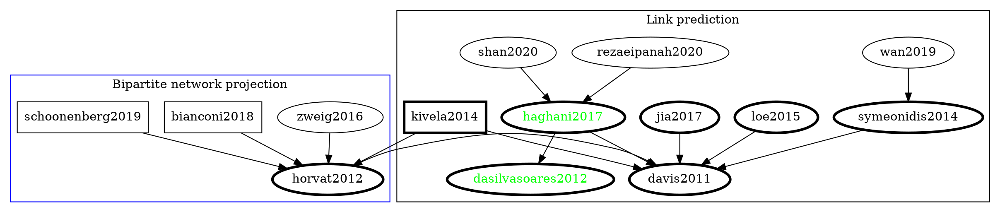

# Related Literature

## Citation graph

### Legend

## Bipartite network projection

* Xuemeng Zhai, Hangyu Hu, Guangmin Hu, and Youyang Qu. 2019. PRBL: a personalized recommendation system based on bipartite network projection and link community detection. In Proceedings of the ACM Turing Celebration Conference - China (ACM TURC '19). Association for Computing Machinery, New York, NY, USA, Article 150, 1–7. DOI:https://doi.org/10.1145/3321408.3326678
* Zhai, X., Zhou, W., Fei, G. et al. Null Model and Community Structure in Multiplex Networks. Sci Rep 8, 3245 (2018). https://doi.org/10.1038/s41598-018-21286-0
* E. Horvát and K. A. Zweig, "One-mode Projection of Multiplex Bipartite Graphs," 2012 IEEE/ACM International Conference on Advances in Social Networks Analysis and Mining, Istanbul, 2012, pp. 599-606 [[horvat2012]](https://doi.org/10.1109/ASONAM.2012.101)
  * Cited by: https://scholar.google.com/scholar?cites=14673846611713516311&as_sdt=2005&sciodt=0,5&hl=en
  * Schoonenberg, Wester CH, Inas S. Khayal, and Amro M. Farid. "The Need for Hetero-functional Graph Theory." In A Hetero-functional Graph Theory for Modeling Interdependent Smart City Infrastructure, pp. 13-21. Springer, Cham, 2019. [[schoonenberg2019]](https://link.springer.com/chapter/10.1007/978-3-319-99301-0_2)
  * Bianconi, Ginestra. Multilayer networks: structure and function. Oxford university press, 2018. [[bianconi2018]](https://books.google.se/books?hl=en&lr=&id=9gJfDwAAQBAJ&oi=fnd&pg=PP1&ots=rJ9hfx7MAU&sig=gmm9FozaMHbDf-eFHKRIvNRQmnw&redir_esc=y#v=onepage&q&f=false)
  * Zweig, Katharina A. "Random Graphs as Null Models." In Network Analysis Literacy, pp. 183-214. Springer, Vienna, 2016. [[zweig2016]](https://link.springer.com/chapter/10.1007/978-3-7091-0741-6_7)

## Link prediction

* D. Davis, R. Lichtenwalter, and N. V. Chawla, "Multi-relational link prediction in heterogeneous information networks, " in Proceedings of the 2011 International Conference on Advances in Social Networks Analysis and Mining (ASONAM '11), 2011, pp. 281-288. [[davis20119]](https://ieeexplore.ieee.org/document/5992590)
  * Cited by :  https://scholar.google.com/scholar?hl=en&as_sdt=5,31&sciodt=0,31&cites=4077150476670634215&scipsc=
  * Chuan Wen Loe, Henrik Jeldtoft Jensen, Comparison of communities detection algorithms for multiplex, Physica A: Statistical Mechanics and its Applications, Volume 431, 2015, Pages 29-45, ISSN 0378-4371 [[loe2015]](https://www.sciencedirect.com/science/article/abs/pii/S0378437115002125?via%3Dihub)
  * Haghani, S., Keyvanpour, M.R. A systemic analysis of link prediction in social network. Artif Intell Rev 52, 1961–1995 (2019). [[haghani2017](/@ThenWho/haghani2017)](https://doi.org/10.1007/s10462-017-9590-2)
    * Cites:
    * da Silva Soares PR, Prudêncio RBC (2012) Time series based link prediction. In: The 2012 international joint conference on neural networks (IJCNN), IEEE, pp 1–7 [[dasilvasoares2012](/@ThenWho/dasilvasoares2012)](https://ieeexplore.ieee.org/document/6252471) 
    * Cited by: https://scholar.google.com/scholar?cites=5998605068901554292&as_sdt=5,31&sciodt=0,31&hl=en
    * Rezaeipanah, A., Ahmadi, G. & Sechin Matoori, S. A classification approach to link prediction in multiplex online ego-social networks. Soc. Netw. Anal. Min. 10, 27 (2020). [[rezaeipanah2020]](https://doi.org/10.1007/s13278-020-00639-6)
    * Na Shan, Longjie Li, Yakun Zhang, Shenshen Bai, Xiaoyun Chen, Supervised link prediction in multiplex networks, Knowledge-Based Systems, Volume 203, 2020, 106168,ISSN 0950-7051,
[[shan2020]](https://doi.org/10.1016/j.knosys.2020.106168) 
  * Symeonidis P., Perentis C. (2014) Link Prediction in Multi-modal Social Networks. In: Calders T., Esposito F., Hüllermeier E., Meo R. (eds) Machine Learning and Knowledge Discovery in Databases. ECML PKDD 2014. Lecture Notes in Computer Science, vol 8726. Springer, Berlin, Heidelberg. [[symeonidis2014]](https://doi.org/10.1007/978-3-662-44845-8_10) 
    * Cong Wan, Yanhui Fang, Cong Wang, Yanxia Lv, Zejie Tian, Yun Wang, "SignRank: A Novel Random Walking Based Ranking Algorithm in Signed Networks", Wireless Communications and Mobile Computing, vol. 2019, Article ID 4813717, 8 pages, 2019. [[wan2019]](https://doi.org/10.1155/2019/4813717) 
  * Y. Jia, Y. Wang, X. Jin, Z. Zhao and X. Cheng, "Link Inference in Dynamic Heterogeneous Information Network: A Knapsack-Based Approach," in IEEE Transactions on Computational Social Systems, vol. 4, no. 3, pp. 80-92, Sept. 2017.
[[jia2017]](https://doi.org/10.1109/TCSS.2017.2715069)
  * Kivelä, Mikko, Alex Arenas, Marc Barthelemy, James P. Gleeson, Yamir Moreno, and Mason A. Porter. "Multilayer networks." Journal of complex networks 2, no. 3 (2014): 203-271. [[kivela2014]](https://doi.org/10.1093/comnet/cnu016)

[> home](https://hackmd.io/@ThenWho/PolisGraph)