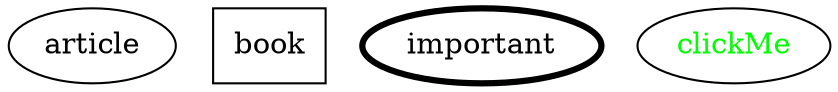
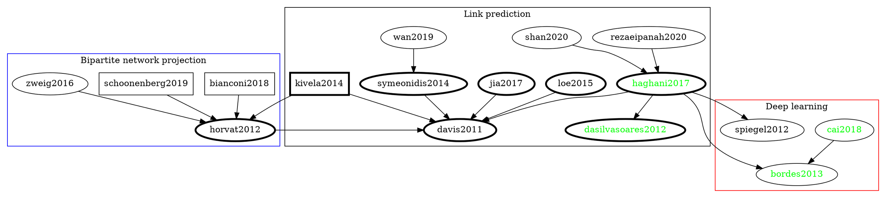

# Related Literature

## Citation graph

### Legend

## Bipartite network projection

| ID  | Citation                                                                                                                                                                                                                                                                                                                                                                     |
| --- | ---------------------------------------------------------------------------------------------------------------------------------------------------------------------------------------------------------------------------------------------------------------------------------------------------------------------------------------------------------------------------- |
|     | Xuemeng Zhai, Hangyu Hu, Guangmin Hu, and Youyang Qu. 2019. PRBL: a personalized recommendation system based on bipartite network projection and link community detection. In Proceedings of the ACM Turing Celebration Conference - China (ACM TURC '19). Association for Computing Machinery, New York, NY, USA, Article 150, 1–7. https://doi.org/10.1145/3321408.3326678 |
|     | Zhai, X., Zhou, W., Fei, G. et al. Null Model and Community Structure in Multiplex Networks. Sci Rep 8, 3245 (2018). https://doi.org/10.1038/s41598-018-21286-0 |
| [horvat2012] | E. Horvát and K. A. Zweig, "One-mode Projection of Multiplex Bipartite Graphs," 2012 IEEE/ACM International Conference on Advances in Social Networks Analysis and Mining, Istanbul, 2012, pp. 599-606 https://doi.org/10.1109/ASONAM.2012.101  |
| [schoonenberg2019] | Schoonenberg, Wester CH, Inas S. Khayal, and Amro M. Farid. "The Need for Hetero-functional Graph Theory." In A Hetero-functional Graph Theory for Modeling Interdependent Smart City Infrastructure, pp. 13-21. Springer, Cham, 2019. https://link.springer.com/chapter/10.1007/978-3-319-99301-0_2  |
| [bianconi2018] | Bianconi, Ginestra. Multilayer networks: structure and function. Oxford university press, 2018. https://books.google.se/books?hl=en&lr=&id=9gJfDwAAQBAJ&oi=fnd&pg=PP1&ots=rJ9hfx7MAU&sig=gmm9FozaMHbDf-eFHKRIvNRQmnw&redir_esc=y#v=onepage&q&f=false |
| [zweig2016] | Zweig, Katharina A. "Random Graphs as Null Models." In Network Analysis Literacy, pp. 183-214. Springer, Vienna, 2016. https://link.springer.com/chapter/10.1007/978-3-7091-0741-6_7  |

## Link prediction

| ID  | Citation |
| --- | -------- |
| [davis20119] | D. Davis, R. Lichtenwalter, and N. V. Chawla, "Multi-relational link prediction in heterogeneous information networks, " in Proceedings of the 2011 International Conference on Advances in Social Networks Analysis and Mining (ASONAM '11), 2011, pp. 281-288. https://ieeexplore.ieee.org/document/5992590  |
| [loe2015] | Chuan Wen Loe, Henrik Jeldtoft Jensen, Comparison of communities detection algorithms for multiplex, Physica A: Statistical Mechanics and its Applications, Volume 431, 2015, Pages 29-45, ISSN 0378-4371 https://www.sciencedirect.com/science/article/abs/pii/S0378437115002125?via%3Dihub  |
| [[haghani2017](/@ThenWho/haghani2017)] | Haghani, S., Keyvanpour, M.R. A systemic analysis of link prediction in social network. Artif Intell Rev 52, 1961–1995 (2019). https://doi.org/10.1007/s10462-017-9590-2  |
| [[dasilvasoares2012](/@ThenWho/dasilvasoares2012)] | da Silva Soares PR, Prudêncio RBC (2012) Time series based link prediction. In: The 2012 international joint conference on neural networks (IJCNN), IEEE, pp 1–7 https://ieeexplore.ieee.org/document/6252471  |
| [rezaeipanah2020] | Rezaeipanah, A., Ahmadi, G. & Sechin Matoori, S. A classification approach to link prediction in multiplex online ego-social networks. Soc. Netw. Anal. Min. 10, 27 (2020). https://doi.org/10.1007/s13278-020-00639-6  |
| [shan2020]  | Na Shan, Longjie Li, Yakun Zhang, Shenshen Bai, Xiaoyun Chen, Supervised link prediction in multiplex networks, Knowledge-Based Systems, Volume 203, 2020, 106168,ISSN 0950-7051, https://doi.org/10.1016/j.knosys.2020.106168  |
| [symeonidis2014] | Symeonidis P., Perentis C. (2014) Link Prediction in Multi-modal Social Networks. In: Calders T., Esposito F., Hüllermeier E., Meo R. (eds) Machine Learning and Knowledge Discovery in Databases. ECML PKDD 2014. Lecture Notes in Computer Science, vol 8726. Springer, Berlin, Heidelberg. https://doi.org/10.1007/978-3-662-44845-8_10  |
| [wan2019] | Cong Wan, Yanhui Fang, Cong Wang, Yanxia Lv, Zejie Tian, Yun Wang, "SignRank: A Novel Random Walking Based Ranking Algorithm in Signed Networks", Wireless Communications and Mobile Computing, vol. 2019, Article ID 4813717, 8 pages, 2019. https://doi.org/10.1155/2019/4813717   |
| [jia2017] | Y. Jia, Y. Wang, X. Jin, Z. Zhao and X. Cheng, "Link Inference in Dynamic Heterogeneous Information Network: A Knapsack-Based Approach," in IEEE Transactions on Computational Social Systems, vol. 4, no. 3, pp. 80-92, Sept. 2017 https://doi.org/10.1109/TCSS.2017.2715069  |
| [kivela2014] | Kivelä, Mikko, Alex Arenas, Marc Barthelemy, James P. Gleeson, Yamir Moreno, and Mason A. Porter. "Multilayer networks." Journal of complex networks 2, no. 3 (2014): 203-271. https://doi.org/10.1093/comnet/cnu016  |

### Latent feature based models

| ID  | Citation |
| --- | -------- |
| [[bordes2013](/@ThenWho/bordes2013)] | Bordes, Antoine, Xavier Glorot, Jason Weston, and Yoshua Bengio. "A semantic matching energy function for learning with multi-relational data." Machine Learning 94, no. 2 (2014): 233-259.  https://doi.org/10.1007/s10994-013-5363-6  |
| [[cai2018](/@ThenWho/cai2018)] | H. Cai, V. W. Zheng and K. C. Chang, "A Comprehensive Survey of Graph Embedding: Problems, Techniques, and Applications," in IEEE Transactions on Knowledge and Data Engineering, vol. 30, no. 9, pp. 1616-1637, 1 Sept. 2018 https://doi.org/10.1109/TKDE.2018.2807452 |
| [[zhu2016]](/pCo0Jb-WS7-0k5gW87d-xw) | L. Zhu, D. Guo, J. Yin, G. V. Steeg and A. Galstyan, "Scalable Temporal Latent Space Inference for Link Prediction in Dynamic Social Networks," in IEEE Transactions on Knowledge and Data Engineering, vol. 28, no. 10, pp. 2765-2777, 1 Oct. 2016  http://doi.org/10.1109/TKDE.2016.2591009  |
| [[keyvanpour2014]](/ey5IFYJAQmWQkKT0KZqvyQ) | Keyvanpour, Mohammad Reza, and Somayyeh Seifi Moradi. "A Perturbation Method Based on Singular Value Decomposition and Feature Selection for Privacy Preserving Data Mining," International Journal of Data Warehousing and Mining (IJDWM) 10 (2014): 1, accessed (October 25, 2020)  https://doi.org/10.4018/ijdwm.2014010104  |
| [[spiegel2012]](/LzPsVc2CTUma2qBKRyPjnA)    |   |
|     |   |

[> home](https://hackmd.io/@ThenWho/PolisGraph)