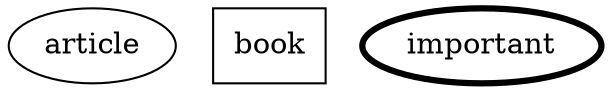
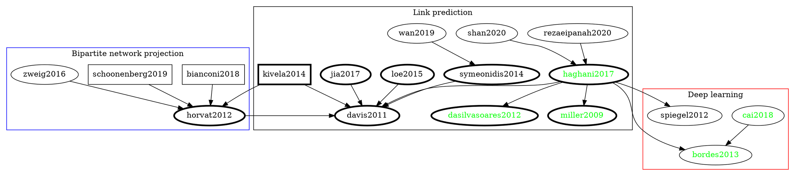
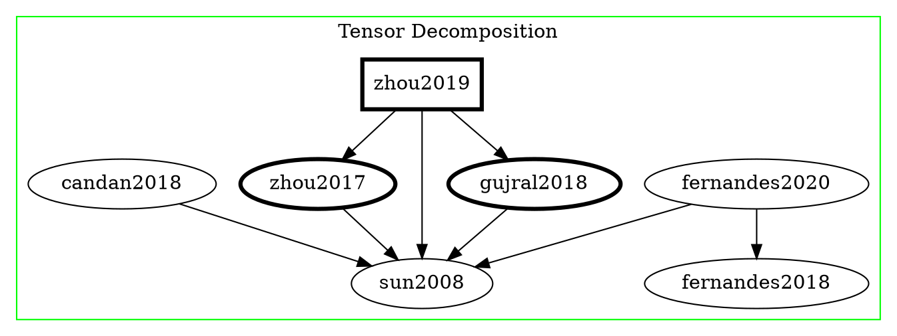

# Related Literature

## Citation graph

### Legend

## Bipartite network projection

| ID  | Citation                     |   Notes          |
| --- | ---------------------------- | ---------------- |
|     | Xuemeng Zhai, Hangyu Hu, Guangmin Hu, and Youyang Qu. 2019. PRBL: a personalized recommendation system based on bipartite network projection and link community detection. In Proceedings of the ACM Turing Celebration Conference - China (ACM TURC '19). Association for Computing Machinery, New York, NY, USA, Article 150, 1–7. https://doi.org/10.1145/3321408.3326678 | |
|     | Zhai, X., Zhou, W., Fei, G. et al. Null Model and Community Structure in Multiplex Networks. Sci Rep 8, 3245 (2018). https://doi.org/10.1038/s41598-018-21286-0 |   |
| [horvat2012] | E. Horvát and K. A. Zweig, "One-mode Projection of Multiplex Bipartite Graphs," 2012 IEEE/ACM International Conference on Advances in Social Networks Analysis and Mining, Istanbul, 2012, pp. 599-606 https://doi.org/10.1109/ASONAM.2012.101  |   |
| [schoonenberg2019] | Schoonenberg, Wester CH, Inas S. Khayal, and Amro M. Farid. "The Need for Hetero-functional Graph Theory." In A Hetero-functional Graph Theory for Modeling Interdependent Smart City Infrastructure, pp. 13-21. Springer, Cham, 2019. https://link.springer.com/chapter/10.1007/978-3-319-99301-0_2  |   |
| [bianconi2018] | Bianconi, Ginestra. Multilayer networks: structure and function. Oxford university press, 2018. https://books.google.se/books?hl=en&lr=&id=9gJfDwAAQBAJ&oi=fnd&pg=PP1&ots=rJ9hfx7MAU&sig=gmm9FozaMHbDf-eFHKRIvNRQmnw&redir_esc=y#v=onepage&q&f=false |   |
| [zweig2016] | Zweig, Katharina A. "Random Graphs as Null Models." In Network Analysis Literacy, pp. 183-214. Springer, Vienna, 2016. https://link.springer.com/chapter/10.1007/978-3-7091-0741-6_7  |   |

## Link prediction

| ID  | Citation |   Notes  |
| --- | -------- | -------- |
| [davis20119] | D. Davis, R. Lichtenwalter, and N. V. Chawla, "Multi-relational link prediction in heterogeneous information networks, " in Proceedings of the 2011 International Conference on Advances in Social Networks Analysis and Mining (ASONAM '11), 2011, pp. 281-288. https://ieeexplore.ieee.org/document/5992590  |   |
| [loe2015] | Chuan Wen Loe, Henrik Jeldtoft Jensen, Comparison of communities detection algorithms for multiplex, Physica A: Statistical Mechanics and its Applications, Volume 431, 2015, Pages 29-45, ISSN 0378-4371 https://www.sciencedirect.com/science/article/abs/pii/S0378437115002125?via%3Dihub  |   |
| [haghani2017] | Haghani, S., Keyvanpour, M.R. A systemic analysis of link prediction in social network. Artif Intell Rev 52, 1961–1995 (2019). https://doi.org/10.1007/s10462-017-9590-2  |  A survey of link prediction algorithms. Emphasis on machine learning (presumably because it’s the latest application at the time of writing).  |
| [dasilvasoares2012] | da Silva Soares PR, Prudêncio RBC (2012) Time series based link prediction. In: The 2012 international joint conference on neural networks (IJCNN), IEEE, pp 1–7 https://ieeexplore.ieee.org/document/6252471  | A simple and flexible mechanism for link prediction: time series out of any node similarity metric + forecasting. Good paper overall. |
| [rezaeipanah2020] | Rezaeipanah, A., Ahmadi, G. & Sechin Matoori, S. A classification approach to link prediction in multiplex online ego-social networks. Soc. Netw. Anal. Min. 10, 27 (2020). https://doi.org/10.1007/s13278-020-00639-6  |   |
| [shan2020]  | Na Shan, Longjie Li, Yakun Zhang, Shenshen Bai, Xiaoyun Chen, Supervised link prediction in multiplex networks, Knowledge-Based Systems, Volume 203, 2020, 106168,ISSN 0950-7051, https://doi.org/10.1016/j.knosys.2020.106168  |   |
| [symeonidis2014] | Symeonidis P., Perentis C. (2014) Link Prediction in Multi-modal Social Networks. In: Calders T., Esposito F., Hüllermeier E., Meo R. (eds) Machine Learning and Knowledge Discovery in Databases. ECML PKDD 2014. Lecture Notes in Computer Science, vol 8726. Springer, Berlin, Heidelberg. https://doi.org/10.1007/978-3-662-44845-8_10  |   |
| [wan2019] | Cong Wan, Yanhui Fang, Cong Wang, Yanxia Lv, Zejie Tian, Yun Wang, "SignRank: A Novel Random Walking Based Ranking Algorithm in Signed Networks", Wireless Communications and Mobile Computing, vol. 2019, Article ID 4813717, 8 pages, 2019. https://doi.org/10.1155/2019/4813717   |   |
| [jia2017] | Y. Jia, Y. Wang, X. Jin, Z. Zhao and X. Cheng, "Link Inference in Dynamic Heterogeneous Information Network: A Knapsack-Based Approach," in IEEE Transactions on Computational Social Systems, vol. 4, no. 3, pp. 80-92, Sept. 2017 https://doi.org/10.1109/TCSS.2017.2715069  |   |
| [kivela2014] | Kivelä, Mikko, Alex Arenas, Marc Barthelemy, James P. Gleeson, Yamir Moreno, and Mason A. Porter. "Multilayer networks." Journal of complex networks 2, no. 3 (2014): 203-271. https://doi.org/10.1093/comnet/cnu016  |   |

### Latent feature based models

| ID  | Citation                     |   Notes          |
| --- | ---------------------------- | ---------------- |
| [bordes2013] | Bordes, Antoine, Xavier Glorot, Jason Weston, and Yoshua Bengio. "A semantic matching energy function for learning with multi-relational data." Machine Learning 94, no. 2 (2014): 233-259.  https://doi.org/10.1007/s10994-013-5363-6  |   |
| [cai2018] | H. Cai, V. W. Zheng and K. C. Chang, "A Comprehensive Survey of Graph Embedding: Problems, Techniques, and Applications," in IEEE Transactions on Knowledge and Data Engineering, vol. 30, no. 9, pp. 1616-1637, 1 Sept. 2018 https://doi.org/10.1109/TKDE.2018.2807452 |   |
| [zhu2016] | L. Zhu, D. Guo, J. Yin, G. V. Steeg and A. Galstyan, "Scalable Temporal Latent Space Inference for Link Prediction in Dynamic Social Networks," in IEEE Transactions on Knowledge and Data Engineering, vol. 28, no. 10, pp. 2765-2777, 1 Oct. 2016  http://doi.org/10.1109/TKDE.2016.2591009  |   |
| [keyvanpour2014] | Keyvanpour, Mohammad Reza, and Somayyeh Seifi Moradi. "A Perturbation Method Based on Singular Value Decomposition and Feature Selection for Privacy Preserving Data Mining," International Journal of Data Warehousing and Mining (IJDWM) 10 (2014): 1, accessed (October 25, 2020)  https://doi.org/10.4018/ijdwm.2014010104  |   |
| [spiegel2012]    | Spiegel, Stephan, Jan Clausen, Sahin Albayrak, and Jérôme Kunegis. "Link prediction on evolving data using tensor factorization." In Pacific-Asia Conference on Knowledge Discovery and Data Mining, pp. 100-110. Springer, Berlin, Heidelberg, 2011.  | A tensor decomposition technique that can be used for link prediction in a dynamic graph. Focus on 3 dimensions (third-order tensor), where the first two can be the adjacency matrix and the third the time. Practical results come from the CP (CanDecomp /ParaFac) technique, which is an approximation of the tensor decomposition. Simple, effective. **Delivery >>>** Simply written, delivers as promised. Good introduction to tensor decomposition. Supports dynamic graphs, but only in time: number of users or items doesn’t change - only the connections between them. No extensions about adding/deleting nodes either.  |
| [[miller2009]](/@ThenWho/miller2009)    | Miller, Kurt, Michael I. Jordan, and Thomas L. Griffiths. "Nonparametric latent feature models for link prediction." In Advances in neural information processing systems, pp. 1276-1284. 2009. |Bayesian non-parametric method to infer both latent features and which entities have which feature. **Delivery >>>** * One author is a psychologist = accessible text to non experts. * Good intro into latent feature approaches. * Few words into * class-based approaches : Stochastic block model * Feature-based approaches : Like this one * Generic method:  * Handles cases where entities belong to more than one categories / have more than one latent features.  * (Generalization of stochastic block models)  * Handles multiple relations between entities. (straightforward) * Indian Buffet Process * Implemented with Monte Carlo Markov Chains * Interesting tricks inspired by bibliography * No clear way to apply method in node addition (= matrix based, computationally non trivial) * Implementation needs careful study (no code given)    |
|[sarkar2012]|  Sarkar, Purnamrita, Deepayan Chakrabarti, and Andrew W. Moore. "Theoretical justification of popular link prediction heuristics." In IJCAI proceedings-international joint conference on artificial intelligence, vol. 22, no. 3, p. 2722. 2011. | Graph theoretic work **Delivery >>>** Check upstream bibliography  |

## Tensor Decomposition
				

| ID         | Citation         | Notes             |
| ---------- | ---------------- | ----------------  |
| [zhou2019] | Zhou, Shuo. "On dynamic tensor decompositions." PhD diss., 2019. | Good primer to incremental tensor decomposition, AKA dynamic tensor decomposition. A couple of algorithms for sparse/dense tensors and slice-/element/wise updates.             |
| [zhou2017] | Zhou, Shuo, Sarah M. Erfani, and James Bailey. "Sced: A general framework for sparse tensor decomposition with constraints and elementwise dynamic learning." In 2017 IEEE International Conference on Data Mining (ICDM), pp. 675-684. IEEE, 2017.  |  Paper of the above thesis that focuses on sparse tensor with element-wise updates. Matlab code available. |
| [gujral2018] | Gujral, Ekta, Ravdeep Pasricha, and Evangelos E. Papalexakis. "Sambaten: Sampling-based batch incremental tensor decomposition." In Proceedings of the 2018 SIAM International Conference on Data Mining, pp. 387-395. Society for Industrial and Applied Mathematics, 2018. | "SamBaTen (gujral2018) is a sampling-based approach that is extended from ParCube (papalexakis2012). Basically, it tries to reduce the scale of the problem by sub-sampling a few sub-tensors, which are simultaneously decomposed by standard ALS algorithm and combined to produce the final results. Compared to the static ParCube algorithm that is sampling directly from the input data, SamBaTen replaces the historical data part with the existing decomposition to achieve memory-save and speedup. However, multiple repetitions are required for a stable result and the efficiency of SamBaTen is still depending on its core ALS procedure." (Matlab code available)   |
| [candan2018]    | Candan, K. Selçuk, Shengyu Huang, Xinsheng Li, and Maria Luisa Sapino. "Effective Tensor-Based Data Clustering Through Sub-Tensor Impact Graphs." In Clustering Methods for Big Data Analytics, pp. 145-179. Springer, Cham, 2019.  |  Methodology to break tensor into sub-tensors, run decompositions on them, and compose the results into a decomp of the full one.   |
| [fernandes2018] | Fernandes, Sofia, Hadi Fanaee-T, and João Gama. "Dynamic graph summarization: a tensor decomposition approach." Data Mining and Knowledge Discovery 32, no. 5 (2018): 1397-1420.  | Summarization techniques for time-evolving tensors.  |
| [fernandes2020] | Fernandes, Sofia, Hadi Fanaee-T, and Joao Gama. "Tensor decomposition for analysing time-evolving social networks: an overview." Artificial Intelligence Review (2020): 1-26.   | Ok primer for tensor decomposition on social network analysis (emph on time-evolving tensors).  |
| [sun2008] | Sun, Jimeng, Dacheng Tao, Spiros Papadimitriou, Philip S. Yu, and Christos Faloutsos. "Incremental tensor analysis: Theory and applications." ACM Transactions on Knowledge Discovery from Data (TKDD) 2, no. 3 (2008): 1-37. | Old but good primer on incremental tensor analysis.  |

[> home](https://hackmd.io/@ThenWho/PolisGraph)